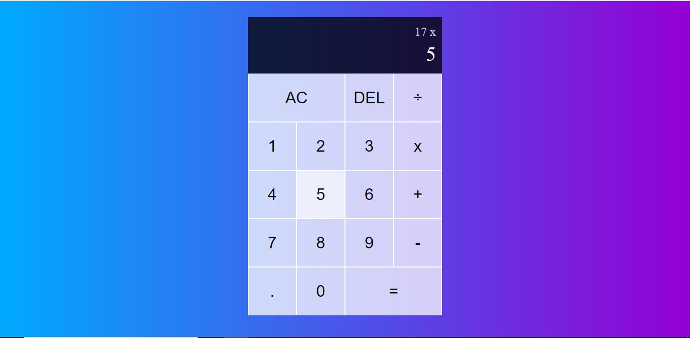

# Calculadora simples

---

### Capa do projeto

### Sobre :pencil:

Neste projeto, eu criei uma calculadora simples.

##### Bug na aplicação

Quando não tem nenhum valor digitado, e clico no ponto a tela inteira fica branca, quando eu clicar no ponto eu quero que um zero seja adicionado automaticamente.

### Próximos passos

- [ ] 1. Fazer uma calculadora cientifica.
- [ ] 2. Fazer uma calculadora HP12c.
- [ ] 3. Criar um conversor de moedas e medidas.
- [ ] 4. Criar as versões mobile.
- [ ] 5. Fazer o deploy.